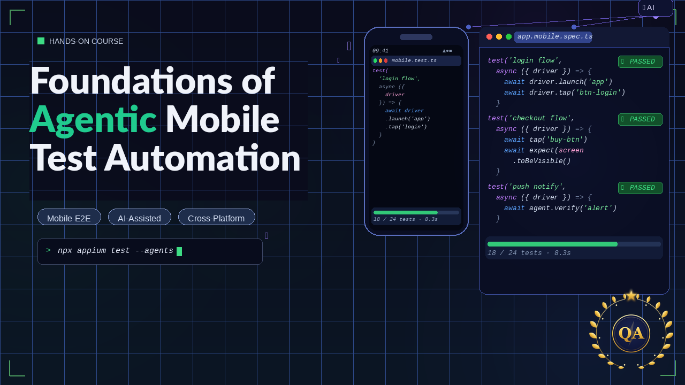

<p align="center">
  
</p>

# droid-detective

Workshop for Agentic Mobile Test Automation — a TypeScript framework combining WebdriverIO, Appium, and Claude Code for AI-assisted Android UI testing.

## What is this?

droid-detective provides two complementary things:

1. **A conventional test suite** — Page Object Model tests for an Android app, written in TypeScript and run via WebdriverIO + Appium.
2. **An agentic locator skill** — A Claude Code slash command (`/appium-locators`) that uses the Appium MCP server to inspect a live Android app and discover UI element locators automatically.

The goal is to demonstrate how an AI agent can reduce the friction of writing mobile tests by handling the tedious part: finding the right selectors.

---

## Prerequisites

| Tool | Version | Notes |
|------|---------|-------|
| Node.js | 20+ | |
| pnpm | 10.28+ | `npm i -g pnpm` |
| Java (JDK) | 11+ | Required by Android SDK |
| Android SDK | any | `ANDROID_HOME` must be set |
| Android emulator | API 30+ | Or a real device via ADB |
| Appium MCP server | latest | For the `/appium-locators` skill |

Install the UIAutomator2 driver once after cloning:

```bash
pnpm run appium:install-driver
```

---

## Installation

```bash
pnpm install
```

Drop your `.apk` into the `apps/` folder. The default config expects `apps/demo.apk`.

---

## Running tests

Start the Android emulator first (`emulator-5554` by default), then:

```bash
# Run all tests
pnpm test

# Explicit Android run
pnpm run test:android
```

WebdriverIO starts Appium automatically as a service, installs the APK, and runs the Mocha suite.

---

## Project structure

```
droid-detective/
├── .claude/
│   └── appium-locators/
│       └── SKILL.md              # /appium-locators Claude Code skill
├── apps/
│   └── demo.apk                  # Android app under test (gitignored)
└── droid/
    ├── wdio.conf.ts               # WebdriverIO + Appium configuration
    ├── globals.d.ts               # WebdriverIO global type declarations
    ├── pageobjects/
    │   ├── base.page.ts           # Shared element interaction methods
    │   └── main.page.ts           # App page object with locators
    └── specs/
        └── example.spec.ts        # Mocha test suite
```

---

## Agentic locator discovery (`/appium-locators`)

This project ships with a Claude Code skill that lets Claude inspect a live Android app using the Appium MCP server and identify the best selectors for each UI element.

### Setup

Configure the Appium MCP server in your Claude Code settings (`claude mcp add` or edit `settings.json`):

```json
{
  "mcpServers": {
    "mcp-appium": {
      "command": "npx",
      "args": ["@appium/mcp-server"]
    }
  }
}
```

### Usage

In Claude Code, run:

```
/appium-locators apps/demo.apk
```

Claude will:
1. Start the Appium server and connect to the Android device
2. Launch the app from the provided APK path
3. Inspect the UI hierarchy on the current screen
4. Return locators ranked by reliability (see priority below)

### Locator priority

The skill instructs Claude to prefer selectors in this order:

| Priority | Strategy | Example |
|----------|----------|---------|
| Preferred | `resourceID` | `com.snappibank.snappiapp:id/LoginButton` |
| Preferred | `accessibilityID` | `~login-button` |
| Good | XPath by text | `//*[contains(@text, "Submit")]` |
| Good | XPath by label | `//*[contains(@label, "Login")]` |
| Good | XPath by value | `//*[contains(@value, "Submit")]` |
| Good | XPath by class | `//*[contains(@class, "EditText")]` |
| Last resort | Complex XPath | `/hierarchy/android.widget...` |

Resource IDs and accessibility IDs are stable across app versions. XPath selectors based on structure break easily when layouts change.

---

## Page Object Model

Tests use the Page Object Model to keep locators out of spec files.

**[base.page.ts](droid/pageobjects/base.page.ts)** provides reusable primitives:

```typescript
waitForElement(selector, timeout?)
tap(selector)
typeText(selector, text)
getText(selector)
isDisplayed(selector)
```

**[main.page.ts](droid/pageobjects/main.page.ts)** defines app-specific elements and actions:

```typescript
// Locators use accessibilityID (tilde prefix) — matches the skill's priority
usernameField  // ~input-email
passwordField  // ~input-password
submitButton   // ~button-LOGIN

// High-level actions
login(username, password)
```

---

## Configuration

Key settings in [droid/wdio.conf.ts](droid/wdio.conf.ts):

| Setting | Value | Description |
|---------|-------|-------------|
| `deviceName` | `emulator-5554` | Target emulator/device ADB name |
| `app` | `../apps/demo.apk` | Path to the APK |
| `noReset` | `false` | Fresh app state for each run |
| `commandTimeoutSec` | `240` | Appium command timeout |
| `waitforTimeout` | `10000` | Default element wait (ms) |

---

## Scripts

```bash
pnpm test                      # Run the full test suite
pnpm run test:android          # Same, with explicit Android platform flag
pnpm run appium                # Start Appium server manually
pnpm run appium:install-driver # Install UIAutomator2 driver
```
